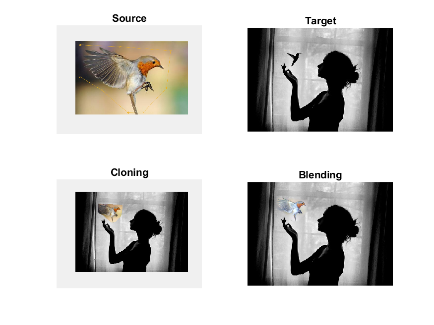

# Poisson-Blending

Poisson Blending Implementation in MATLAB 

## Getting Started

Poisson Blending was implemented with sparse matrix to solve the linear equation (Ax=b). It can
handle gray or RGB image by recursive method. The error sum showed very small number.

### Prerequisites

This project is tested on MATLAB 2018

```
MATLAB2018 
```

### Run
Select background and target images in main.m, then execute main.m
Default images in 'image' folder
```
main
```

End with an example of getting some data out of the system or using it for a little demo

## Result



## Author

Suhong Kim – [@github](https://github.com/suhongkim) – suhongkim11@gmail.com
<!--Distributed under the XYZ license. See ``LICENSE`` for more information.-->

## Inspiration
You can get more information on this assignment from 
[here](https://github.com/suhongkim/UNet-Image-Segmentation/blob/master/ref/Project%201%20-%20UNet.pdf)\
Also, you can start from the original framework
[here](https://drive.google.com/file/d/15eX5Hs_2BiZWb8DuVCX7EqMROtirhsqW/view)


## License

This project is licensed under the MIT License - see the [LICENSE.md](LICENSE.md) file for details
